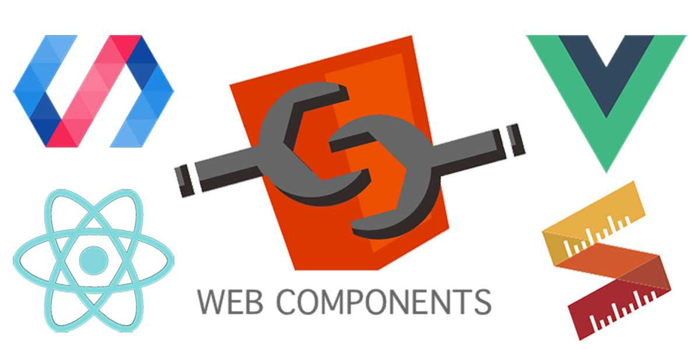
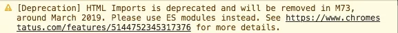
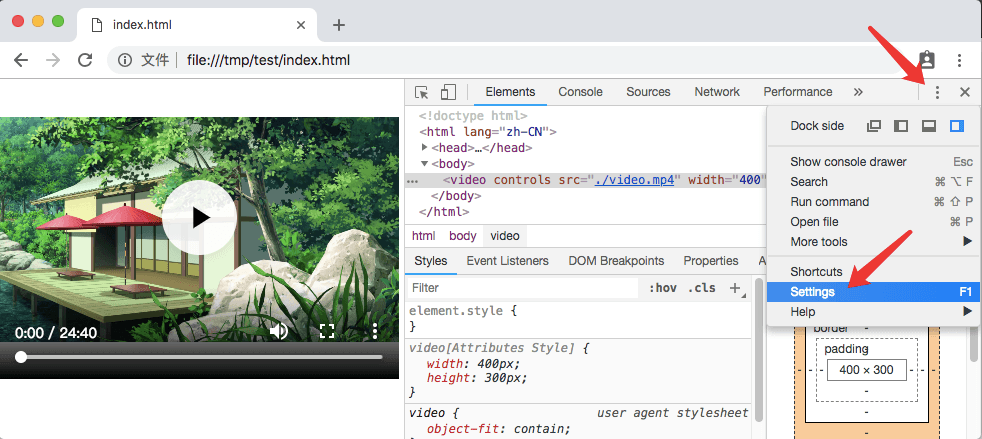
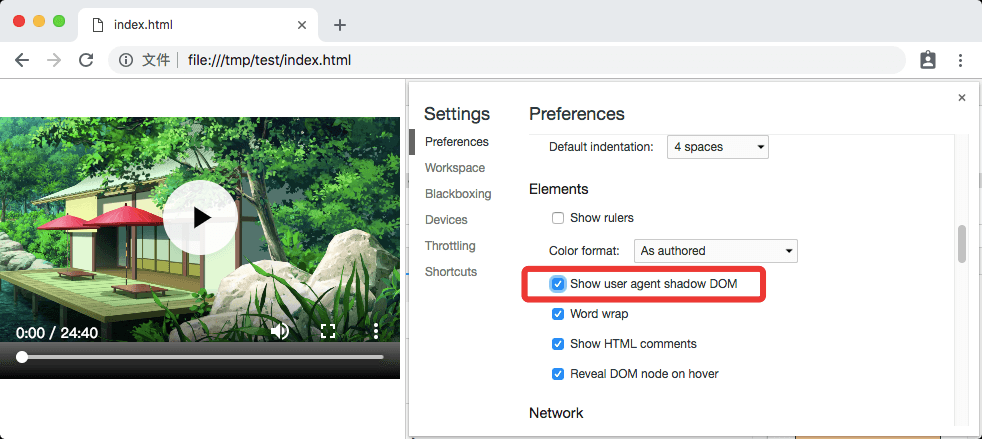
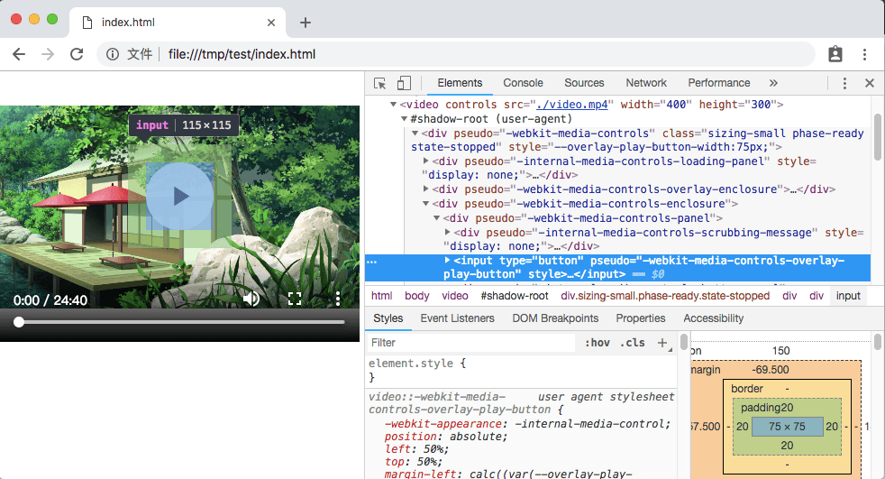
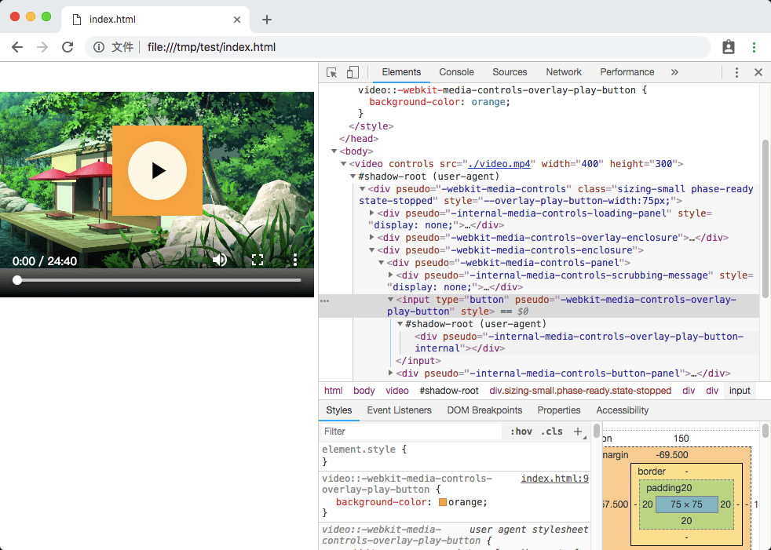
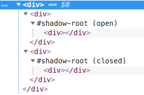
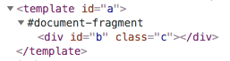
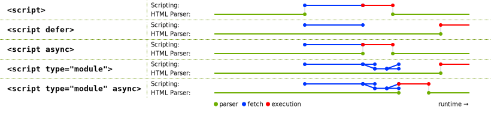
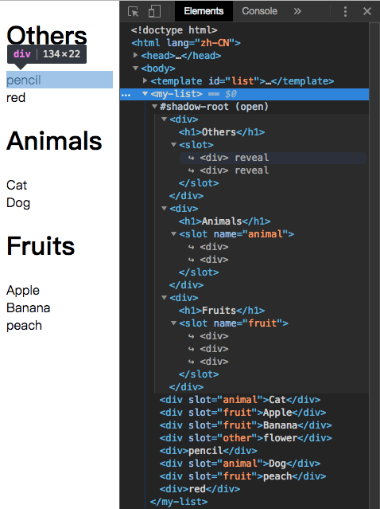

# 原生 HTML 组件



>嘿！看看这几年啊，Web 前端的发展可是真快啊！

>想想几年前，HTML 是前端开发者的基本技能，通过各式各样的标签就可以搭建一个可用的网站，基本交互也不是问题。如果再来点 CSS，嗯，金黄酥脆，美味可口。这时候再撒上几把 JavaScript，简直让人欲罢不能。

>随着需求的增长，HTML 的结构越来越复杂，大量重复的代码使得页面改动起来异常困难，这也就孵化了一批批模版工具，将公共的部分抽取出来变为公共组件。再后来，随着 JavaScript 的性能提升，JavaScript 的地位越来越高，不再只是配菜了，前端渲染的出现降低了服务端解析模版的压力，服务端只要提供静态文件和 API 接口就行了嘛。再然后，前端渲染工具又被搬回了服务端，后端渲染出现了（黑人问号？？？）

>总之，组件化使得复杂的前端结构变得清晰，各个部分独立起来，高内聚低耦合，使得维护成本大大降低。

>那么，你有听说过原生 HTML 组件吗？

## 四大 Web 组件

在说原生 HTML 组件之前，要先简单介绍一下四大 Web 组件标准，四大 Web 组件标准分别为：HTML Template、Shadow DOM、Custom Elements 和 HTML Imports。实际上其中一个已经被废弃了，所以变成“三大”了。

HTML Template 相信很多人都有所耳闻，简单的讲也就是 HTML5 中的 <template> 标签，正常情况下它无色无味，感知不到它的存在，甚至它下面的 img 都不会被下载，script 都不会被执行。<template> 就如它的名字一样，它只是一个模版，只有到你用到它时，它才会变得有意义。

Shadow DOM 则是原生组件封装的基本工具，它可以实现组件与组件之间的独立性。

Custom Elements 是用来包装原生组件的容器，通过它，你就只需要写一个标签，就能得到一个完整的组件。

HTML Imports 则是 HTML 中类似于 ES6 Module 的一个东西，你可以直接 import 另一个 html 文件，然后使用其中的 DOM 节点。但是，由于 HTML Imports 和 ES6 Module 实在是太像了，并且除了 Chrome 以外没有浏览器愿意实现它，所以它已经被废弃并不推荐使用了。未来会使用 ES6 Module 来取代它，但是现在貌似还没有取代的方案，在新版的 Chrome 中这个功能已经被删除了，并且在使用的时候会在 Console 中给出警告。警告中说使用 ES Modules 来取代，但是我测试在 Chrome 71 中 ES Module 会强制检测文件的 MIME 类型必须为 JavaScript 类型，应该是暂时还没有实现支持。


## Shadow DOM

要说原生 HTML 组件，就要先聊聊 Shadow DOM 到底是个什么东西。

大家对 DOM 都很熟悉了，在 HTML 中作为一个最基础的骨架而存在，它是一个树结构，树上的每一个节点都是 HTML 中的一部分。DOM 作为一棵树，它拥有着上下级的层级关系，我们通常使用“父节点”、“子节点”、“兄弟节点”等来进行描述（当然有人觉得这些称谓强调性别，所以也创造了一些性别无关的称谓）。子节点在一定程度上会继承父节点的一些东西，也会因兄弟节点而产生一定的影响，比较明显的是在应用 CSS Style 的时候，子节点会从父节点那里继承一些样式。

而 Shadow DOM，也是 DOM 的一种，所以它也是一颗树，只不过它是长在 DOM 树上的一棵特殊的子树。

什么？DOM 本身不就是由一棵一棵的子树组成的吗？这个 Shadow DOM 有什么特别的吗？

Shadow DOM 的特别之处就在于它致力于创建一个相对独立的一个空间，虽然也是长在 DOM 树上的，但是它的环境却是与外界隔离的，当然这个隔离是相对的，在这个隔离空间中，你可以选择性地从 DOM 树上的父节点继承一些属性，甚至是继承一棵 DOM 树进来。

利用 Shadow DOM 的隔离性，我们就可以创造原生的 HTML 组件了。

实际上，浏览器已经通过 Shadow DOM 实现了一些组件了，只是我们使用过却没有察觉而已，这也是 Shadow DOM 封装的组件的魅力所在：你只管写一个 HTML 标签，其他的交给我。（是不是有点像 React 的 JSX 啊？）

我们来看一看浏览器利用 Shadow DOM 实现的一个示例吧，那就是 video 标签：

```html

<video controls src="./video.mp4"width="400"height="300"></video>
```
我们来看一下浏览器渲染的结果：
(assets/demo1.png)

等一下！不是说 Shadow DOM 吗？这和普通 DOM 有啥区别？？？

在 Chrome 中，Elements 默认是不显示内部实现的 Shadow DOM 节点的，需要在设置中启用：



>注：浏览器默认隐藏自身的 Shadow DOM 实现，但如果是用户通过脚本创造的 Shadow DOM，是不会被隐藏的。

然后，我们就可以看到 video 标签的真面目了：


在这里，你可完全像调试普通 DOM 一样随意调整 Shadow DOM 中的内容（反正和普通 DOM 一样，刷新一下就恢复了）。

我们可以看到上面这些 shadow DOM 中的节点大多都有 pseudo 属性，根据这个属性，你就可以在外面编写 CSS 样式来控制对应的节点样式了。比如，将上面这个 pseudo="-webkit-media-controls-overlay-play-button" 的 input 按钮的背景色改为橙色：

```css
video::-webkit-media-controls-overlay-play-button {
  background-color: orange;
}
```


由于 Shadow DOM 实际上也是 DOM 的一种，所以在 Shadow DOM 中还可以继续嵌套 Shadow DOM，就像上面那样。

浏览器中还有很多 Element 都使用了 Shadow DOM 的形式进行封装，比如 <input>、<select>、<audio> 等，这里就不一一展示了。

由于 Shadow DOM 的隔离性，所以即便是你在外面写了个样式：div { background-color: red !important; }，Shadow DOM 内部的 div 也不会受到任何影响。

也就是说，写样式的时候，该用 id 的时候就用 id，该用 class 的时候就用 class，一个按钮的 class 应该写成 .button 就写成 .button。完全不用考虑当前组件中的 id、class 可能会与其他组件冲突，你只要确保一个组件内部不冲突就好——这很容易做到。

这解决了现在绝大多数的组件化框架都面临的问题：Element 的 class(className) 到底怎么写？用前缀命名空间的形式会导致 class 名太长，像这样：.header-nav-list-sublist-button-icon；而使用一些 CSS-in-JS 工具，可以创造一些唯一的 class 名称，像这样：.Nav__welcomeWrapper___lKXTg，这样的名称仍旧有点长，还带了冗余信息。

## ShadowRoot

ShadowRoot 是 Shadow DOM 下面的根，你可以把它当做 DOM 中的 <body> 一样看待，但是它不是 <body>，所以你不能使用 <body> 上的一些属性，甚至它不是一个节点。

你可以通过 ShadowRoot 下面的 appendChild、querySelectorAll 之类的属性或方法去操作整个 Shadow DOM 树。

对于一个普通的 Element，比如 <div>，你可以通过调用它上面的 attachShadow 方法来创建一个 ShadowRoot（还有一个 createShadowRoot 方法，已经过时不推荐使用），attachShadow 接受一个对象进行初始化：{ mode: 'open' }，这个对象有一个 mode 属性，它有两个取值：'open' 和 'closed'，这个属性是在创造 ShadowRoot 的时候需要初始化提供的，并在创建 ShadowRoot 之后成为一个只读属性。

mode: 'open' 和 mode: 'closed' 有什么区别呢？在调用 attachShadow 创建 ShadowRoot 之后，attachShdow 方法会返回 ShadowRoot 对象实例，你可以通过这个返回值去构造整个 Shadow DOM。当 mode 为 'open' 时，在用于创建 ShadowRoot 的外部普通节点（比如 <div>）上，会有一个 shadowRoot 属性，这个属性也就是创造出来的那个 ShadowRoot，也就是说，在创建 ShadowRoot 之后，还是可以在任何地方通过这个属性再得到 ShadowRoot，继续对其进行改造；而当 mode 为 'closed' 时，你将不能再得到这个属性，这个属性会被设置为 null，也就是说，你只能在 attachShadow 之后得到 ShadowRoot 对象，用于构造整个 Shadow DOM，一旦你失去对这个对象的引用，你就无法再对 Shadow DOM 进行改造了。

可以从上面 Shadow DOM 的截图中看到 #shadow-root (user-agent) 的字样，这就是 ShadowRoot 对象了，而括号中的 user-agent 表示这是浏览器内部实现的 Shadow DOM，如果使用通过脚本自己创建的 ShadowRoot，括号中会显示为 open 或 closed 表示 Shadow DOM 的 mode。



> 浏览器内部实现的 user-agent 的 mode 为 closed，所以你不能通过节点的 ShadowRoot 属性去获得其 ShadowRoot 对象，也就意味着你不能通过脚本对这些浏览器内部实现的 Shadow DOM 进行改造。

## HTML Template

有了 ShadowRoot 对象，我们可以通过代码来创建内部结构了，对于简单的结构，也许我们可以直接通过 document.createElement 来创建，但是稍微复杂一些的结构，如果全部都这样来创建不仅麻烦，而且代码可读性也很差。当然也可以通过 ES6 提供的反引号字符串（const template = `......`;）配合 innerHTML 来构造结构，利用反引号字符串中可以任意换行，并且 HTML 对缩进并不敏感的特性来实现模版，但是这样也是不够优雅，毕竟代码里大段大段的 HTML 字符串并不美观，即便是单独抽出一个常量文件也是一样。

这个时候就可以请 HTML Template 出场了。我们可以在 html 文档中编写 DOM 结构，然后在 ShadowRoot 中加载过来即可。

HTML Template 实际上就是在 html 中的一个 <template> 标签，正常情况下，这个标签下的内容是不会被渲染的，包括标签下的 img、style、script 等都是不会被加载或执行的。你可以在脚本中使用 getElementById 之类的方法得到 <template> 标签对应的节点，但是却无法直接访问到其内部的节点，因为默认他们只是模版，在浏览器中表现为 #document-fragment，字面意思就是“文档片段”，可以通过节点对象的 content 属性来访问到这个 document-fragment 对象。
  


通过 document-fragment 对象，就可以访问到 template 内部的节点了，通过 document.importNode 方法，可以将 document-fragment 对象创建一份副本，然后可以使用一切 DOM 属性方法替换副本中的模版内容，最终将其插入到 DOM 或是 Shadow DOM 中。

```html
<div id="div"></div>
<template id="temp">
  <div id="title"></div>
</template>
```

```js
const template = document.getElementById('temp');
const copy = document.importNode(template.content, true);
copy.getElementById('title').innerHTML = 'Hello World!';

const div = document.getElementById('div');
const shadowRoot = div.attachShadow({ mode: 'closed' });
shadowRoot.appendChild(copy);
```

## HTML Imports

有了 HTML Template，我们已经可以方便地创造封闭的 Web 组件了，但是目前还有一些不完美的地方：我们必须要在 html 中定义一大批的 <template>，每个组件都要定义一个 <template>。

此时，我们就可以用到已经被废弃的 HTML Imports 了。虽然它已经被废弃了，但是未来会通过 ES6 Modules 的形式再进行支持，所以理论上也只是换个加载形式而已。

通过 HTML Imports，我们可以将 <template> 定义在其他的 html 文档中，然后再在需要的 html 文档中进行导入（当然也可以通过脚本按需导入），导入后，我们就可以直接使用其中定义的模版节点了。

已经废弃的 HTML Imports 通过 <link> 标签实现，只要指定 rel="import" 就可以了，就像这样：<link rel="import" href="./templates.html">，它可以接受 onload 和 onerror 事件以指示它已经加载完成。当然也可以通过脚本来创建 link 节点，然后指定 rel 和 href 来按需加载。Import 成功后，在 link 节点上有一个 import 属性，这个属性中存储的就是 import 进来的 DOM 树啦，可以 querySelector 之类的，并通过 cloneNode 或 document.importNode 方法创建副本后使用。

未来新的 HTML Imports 将会以 ES6 Module 的形式提供，可以在 JavaScript 中直接 import * as template from './template.html';，也可以按需 import，像这样：const template = await import('./template.html');。不过目前虽然浏览器都已经支持 ES6 Modules，但是在 import 其他模块时会检查服务端返回文件的 MIME 类型必须为 JavaScript 的 MIME 类型，否则不允许加载。

## Custom Elements

有了上面的三个组件标准，我们实际上只是对 HTML 进行拆分而已，将一个大的 DOM 树拆成一个个相互隔离的小 DOM 树，这还不是真正的组件。

要实现一个真正的组件，我们就需要用到 Custom Elements 了，就如它的名字一样，它是用来定义原生组件的。

Custom Elements 的核心，实际上就是利用 JavaScript 中的对象继承，去继承 HTML 原生的 HTMLElement 类（或是具体的某个原生 Element 类，比如 HTMLButtonElement），然后自己编写相关的生命周期函数，处理成员属性以及用户交互的事件。

看起来这和现在的 React 很像，在 React 中，你可以这样创造一个组件：class MyElement extends React.Component { ... }，而使用原生 Custom Elements，你需要这样写：class MyElement extends HTMLElement { ... }。

Custom Elements 的生命周期函数并不多，但是足够使用。这里我将 Custom Elements 的生命周期函数与 React 进行一个简单的对比:

- constructor(): 构造函数，用于初始化 state、创建 Shadow DOM、监听事件之类。

对应 React 中 Mounting 阶段的大半部分，包括：constructor(props)、static getDerivedStateFromProps(props, state) 和 render()。

在 Custom Elements 中，constructor() 构造函数就是其原本的含义：初始化，和 React 的初始化类似，但它没有像 React 中那样将其拆分为多个部分。在这个阶段，组件仅仅是被创建出来（比如通过 document.createElement()），但是还没有插入到 DOM 树中。

- connectedCallback(): 组件实例已被插入到 DOM 树中，用于进行一些展示相关的初始化操作。

对应 React 中 Mounting 阶段的最后一个生命周期：componentDidMount()。

在这个阶段，组件已经被插入到 DOM 树中了，或是其本身就在 html 文件中写好在 DOM 树上了，这个阶段一般是进行一些展示相关的初始化，比如加载数据、图片、音频或视频之类并进行展示。

- attributeChangedCallback(attrName, oldVal, newVal): 组件属性发生变化，用于更新组件的状态。

对应 React 中的 Updating 阶段：static getDerivedStateFromProps(props, state)、shouldComponentUpdate(nextProps, nextState)、render()、getSnapshotBeforeUpdate(prevProps, prevState) 和 componentDidUpdate(prevProps, prevState, snapshot)。

当组件的属性（React 中的 props）发生变化时触发这个生命周期，但是并不是所有属性变化都会触发，比如组件的 class、style 之类的属性发生变化一般是不会产生特殊交互的，如果所有属性发生变化都触发这个生命周期的话，会使得性能造成较大的影响。所以 Custom Elements 要求开发者提供一个属性列表，只有当属性列表中的属性发生变化时才会触发这个生命周期函数。

这个属性列表通过组件类上的一个**静态只读**属性来声明，在 ES6 Class 中使用一个 getter 函数来实现，只实现 getter 而不实现 setter，getter 返回一个常量，这样就是只读的了。像这样：

```js
class AwesomeElement extends HTMLElement {
  static get observedAttributes() {
    return ['awesome'];
  }
}
```

- disconnectedCallback(): 组件被从 DOM 树中移除，用于进行一些清理操作。

对应 React 中的 Unmounting 阶段：componentWillUnmount()。

- adoptedCallback(): 组件实例从一个文档被移动到另一个文档。

这个生命周期是原生组件独有的，React 中没有类似的生命周期。这个生命周期函数也并不常用到，一般在操作多个 document 的时候会遇到，调用 document.adoptNode() 函数转移节点所属 document 时会触发这个生命周期。

在定义了自定义组件后，我们需要将它注册到 HTML 标签列表中，通过 window.customElements.define() 函数即可实现，这个函数接受两个必须参数和一个可选参数。第一个参数是注册的标签名，为了避免和 HTML 自身的标签冲突，Custom Elements 要求用户自定义的组件名必须至少包含一个短杠 -，并且不能以短杠开头，比如 my-element、awesome-button 之类都是可以的。第二个参数是注册的组件的 class，直接将继承的子类类名传入即可，当然也可以直接写一个匿名类：

```js
window.customElements.define('my-element', class extends HTMLElement {
  ...
});
```

注册之后，我们就可以使用了，可以直接在 html 文档中写对应的标签，比如：<my-element></my-element>，也可以通过 document.createElement('my-element') 来创建，用法与普通标签几乎完全一样。但要注意的是，虽然 html 标准中说部分标签可以不关闭或是自关闭(<br> 或是 <br />)，但是只有规定的少数几个标签允许自关闭，所以，在 html 中写 Custom Elements 的节点时必须带上关闭标签。

由于 Custom Elements 是通过 JavaScript 来定义的，而一般 js 文件都是通过 <script> 标签外联的，所以 html 文档中的 Custom Elements 在 JavaScript 未执行时是处于一个默认的状态，浏览器默认会将其内容直接显示出来。为了避免这样的情况发生，Custom Elements 在被注册后都会有一个 :defined CSS 伪类而在注册前没有，所以我们可以通过 CSS 选择器在 Custom Elements 注册前将其隐藏起来，比如：
  
```js
  my-element:not(:defined) {
  display: none;
}
```

或者 Custom Elements 也提供了一个函数来检测指定的组件是否已经被注册：customElements.whenDefined()，这个函数接受一个组件名参数，并返回一个 Promise，当 Promise 被 resolve 时，就表示组件被注册了。

这样，我们就可以放心的在加载 Custom Elements 的 JavaScript 的 <script> 标签上使用 async 属性来延迟加载了（当然，如果是使用 ES6 Modules 形式的话默认的加载行为就会和 defer 类似）。
  
 
  
## Custom Elements + Shadow DOM

使用 Custom Elements 来创建组件时，通常会与 Shadow DOM 进行结合，利用 Shadow DOM 的隔离性，就可以创造独立的组件。

通常在 Custom Elements 的 constructor() 构造函数中去创建 Shadow DOM，并对 Shadow DOM 中的节点添加事件监听、对特定事件触发原生 Events 对象。

正常编写 html 文档时，我们可能会给 Custom Elements 添加一些子节点，像这样：<my-element><h1>Title</h1><p>Content</p></my-element>，而我们创建的 Shadow DOM 又拥有其自己的结构，怎样将这些子节点放置到 Shadow DOM 中正确的位置上呢？

在 React 中，这些子节点被放置在 props 的 children 中，我们可以在 render() 时选择将它放在哪里。而在 Shadow DOM 中有一个特殊的标签：<slot>，这个标签的用处就如同其字面意思，在 Shadow DOM 上放置一个“插槽”，然后 Custom Elements 的子节点就会自动放置到这个“插槽”中了。

有时我们需要更加精确地控制子节点在 Shadow DOM 中的位置，而默认情况下，所有子节点都会被放置在同一个 <slot> 标签下，即便是你写了多个 <slot>。那怎样更精确地对子节点进行控制呢？

默认情况下，<slot>Fallback</slot> 这样的是默认的 <slot>，只有第一个默认的 <slot> 会有效，将所有子节点全部放进去，如果没有可用的子节点，将会显示默认的 Fallback 内容（Fallback 可以是一棵子 DOM 树）。

<slot> 标签有一个 name 属性，当你提供 name 后，它将变为一个“有名字的 <slot>”，这样的 <slot> 可以存在多个，只要名字各不相同。此时他们会自动匹配 Custom Elements 下带 slot 属性并且 slot 属性与自身 name 相同的子节点，像这样：

```html
<template id="list">
  <div>
    <h1>Others</h1>
    <slot></slot>
  </div>
  <div>
    <h1>Animals</h1>
    <slot name="animal"></slot>
  </div>
  <div>
    <h1>Fruits</h1>
    <slot name="fruit"></slot>
  </div>
</template>

<my-list>
  <div slot="animal">Cat</div>
  <div slot="fruit">Apple</div>
  <div slot="fruit">Banana</div>
  <div slot="other">flower</div>
  <div>pencil</div>
  <div slot="animal">Dog</div>
  <div slot="fruit">peach</div>
  <div>red</div>
</my-list>
```

```js
class MyList extends HTMLElement {
  constructor() {
    super();
    const root = this.attachShadow({ mode: 'open' });
    const template = document.getElementById('list');
    root.appendChild(document.importNode(template.content, true));
  }
}
customElements.define('my-list', MyList);
```

这样就可以得到如图所示的结构，#shadow-root (open) 表示这是一个开放的 Shadow DOM，下面的节点是直接从 template 中 clone 过来的，浏览器自动在三个 <slot> 标签下放置了几个灰色的 <div> 节点，实际上这些灰色的 <div> 节点表示的是到其真实节点的“引用”，鼠标移动到他们上会显示一个 reveal 链接，点击这个链接即可跳转至其真实节点。
  

这里我们可以看到，虽然 <my-list> 下的子节点是乱序放置的，但是只要是给定了 slot 属性，就会被放置到正确的 <slot> 标签下。注意观察其中有一个 <div slot="other">flower</div>，这个节点由于指定了 slot="other"，但是却找不到匹配的 <slot> 标签，所以它不会被显示在结果中。

在为 Custom Elements 下的 Shadow DOM 设置样式的时候，我们可以直接在 Shadow DOM 下放置 <style> 标签，也可以放置 <link rel="stylesheet">，Shadow DOM 下的样式都是局部的，所以不用担心会影响到 Shadow DOM 的外部。并且由于这些样式仅影响局部🌻，所以对性能也有很大的提升。

在 Shadow DOM 内部的样式中，也有一些特定的选择器，比如 :host 选择器，代表着 ShadowRoot，这类似于普通 DOM 中的 :root，并且它可以与其他伪类组合使用，比如当鼠标在组件上时：:host(:hover)，当组件拥有某个 class 时：:host(.awesome)，当组件拥有 disabled 属性时：:host([disabled])……但是 :host 是拥有继承属性的，所以如果在 Custom Elements 外部定义了某些样式，将会覆盖 :host 中的样式，这样就可以轻松地实现各式各样的“主题风格”了。

为了实现自定义主题，我们还可以使用 Shadow DOM 提供的 :host-context() 选择器，这个选择器允许检查 Shadow DOM 的任何祖先节点是否包含指定选择器。比如如果在最外层 DOM 的 <html> 或 <body> 上有一个 class：.night，则 Shadow DOM 内就可以使用 :host-context(.night) 来指定一个夜晚的主题。这样可以实现主题样式的继承。

还有一种样式的定义方式是利用 CSS 变量。我们在 Shadow DOM 中使用变量来指定样式，比如：background-color: var(--bg-colour, #0F0);，这样就可以在 Shadow DOM 外面指定 --bg-colour 变量来设置样式了，如果没有指定变量，将使用默认的样式颜色 #0F0。

有时我们需要在 Shadow DOM 内部使用完全自定义的样式，比如字体样式、字体大小，如果任由其继承可能导致布局错乱，而每次在组件外面指定样式又略显麻烦，并且也破坏了组件的封装性。所以，Shadow DOM 提供了一个 all 属性，只要指定 :host{ all: initial; } 就可以重置所有继承的属性。

## 总结

Web Components 的概念最初是由 Alex Russell 在 Fronteers Conference 2011提出的，这个概念在当时非常的震撼。2013 年，Google 推出了一个叫做“Polymer)”的 Web Components 框架以推动 Web Components 的发展。

2014 年，Chrome 发布了早期版本的 Web Components 组件规范，包括 Custom Elements v0、Shadow DOM v0 和 HTML Imports。但是此时的规范都还是实验性的，现在已经不推荐使用，并且被 Custom Elements v1、Shadow DOM v1 标准取代，而 HTML Imports 却没有标准化，将来会被 ES6 Modules 所取代。

v0 规范将会在 Chrome 70 中被标记弃用警告，并在 2019 年 3 月左右从 Chrome 73 中删除。

而 v1 标准已经在 Chrome 54+ 和 Safari 10.1+ 中支持，并计划本月（2018 年 10 月）在 Firefox 中正式支持（此前 Firefox 已经支持，但默认禁用，需要在 about:config 中启用）。

而 HTML Templates 作为 HTML5 的功能早已被各大浏览器接受并支持。

>由于 Web Components 涉及到的子项较多，这里就不给出 Can I Use 的截图了，读者可以自行去搜索“Web Components”查看相关兼容性，或是点击这里。

>Can I Use 中包含了 HTML Templates、HTML Imports、Shadow DOM v0、Custom Elements v0、Shadow DOM v1 和 Custom Elements v1 的相关浏览器兼容性和注释，非常详细。

原生 HTML 组件基于的 Web Components 不是单一的技术，他是由 W3C 定义的一系列浏览器标准组成的，通过浏览器自身可以理解的方式去构建组件，这将成为未来的前端标准。

原文：
https://knownsec-fed.com/2018-10-05-ni-ting-shuo-guo-yuan-sheng-html-zu-jian-ma/

